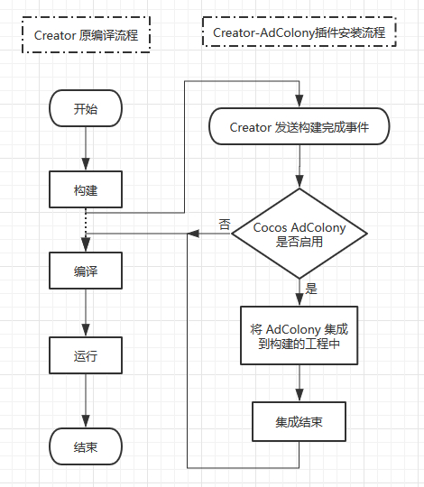
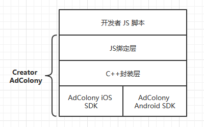
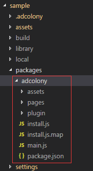
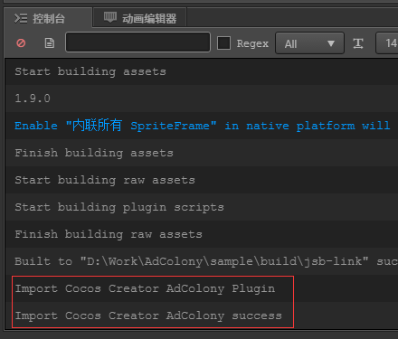
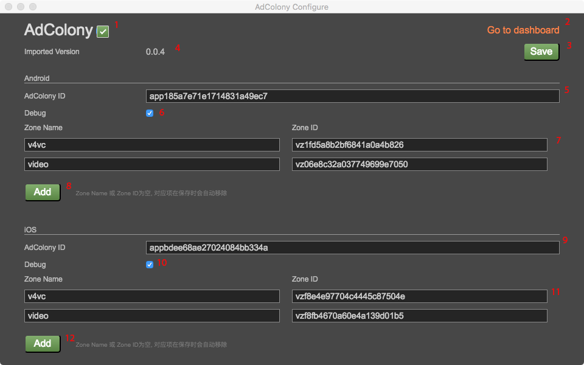

# Cocos AdColony

## 介绍

`Creator AdColony` 是一个 `Cocos Creator` 的插件包. 它可以在 `Creator` 工程构建时, 自动把 `AdColony` 提供的 `iOS`, `Android` SDK 集成到 `Creator` 所构建的 `Cocos2d-x` 工程中 (如 `jsb-link`, `jsb-default`, ...).

`Creator AdColony` 有如下几部分组成:

1. AdColony 的 iOS/Android SDK
2. 对 AdColony SDK 在 Cocos2d-x 上实现统一跨 iOS/Android 的封装层
3. 将封装层绑定到 js 中的绑定层
4. Creator 插件的界面配置
5. 将 Creator AdColony 集成到 Cocos2d-x 工程中的安装器

`Creator AdColony` 的安装流程如下图所示:



`Creator AdColony` 在 App 中运行的的结构如下图所示:



## 使用

### Creator 编辑器部分

1. 将 `Creator AdColony` 插件放到对应工程的 packages 目录下, 如下图所示:



2. 此时，应该可以在 Creator 的菜单 '扩展' 中看到 AdColony 子菜单

3. 打开 AdColony 的配置界面 (Creator菜单->扩展->AdColony->Configure)

4. 在配置界面, AdColony 如果是勾选状态, 那么开发者构建时，就会把 AdColony 集成到开发者的工程中. 在配置界面还可以配置 AdColony 运行所需要的配置信息, 如 AdColonyId, 广告单元信息等等. (更多的配置请见 AdColony 的[官方网址](https://www.adcolony.com/))

5. 如果 AdColony 是激活状态, 那么开发者构建后，应该可以在 Creator 的 Log 窗口中见到如下信息:



### 配置界面详细介绍

这是 Cocos AdColony 的配置界面:


图片各标注的含义介绍:

1. Cocos AdColony 激活状态, 只有当此按钮为勾选状态, Cocos AdColony才会工作. (如果用户先勾选, 构建后，再去掉此勾选, 已安装的 AdColony SDK 不会从工程中删除)
2. 这是到 AdColony SDK 网站的链接
3. 保存按钮, 用户修改了配置后，可以点击此，保存相应设置.
4. 这是 Cocoos AdColony 的插件版本. （注意不是 AdColony SDK 的版本）
5. 这是 AdColony 给用户生成的用于 Android 平台的应用 ID
6. 是否开启 Debug
7. Zone Name(广告名字), Zone ID(广告 ID), Zone Name 是用户自定义的，用于在脚本中显示对应广告时使用, 方便标识与记忆, Zone ID 来自于 AdColony, 用户在 AdColony 配置好广告，会生成对应的 Zone ID
8. 增加 Zone Name/Zone ID (注意, Zone Name/Zone ID 最多为 15个, 同时如果, Zone Name/Zone ID中有一个为空, 保存时, 此项不会保存)
9. iOS平台, 同 5
10. iOS平台, 同 6
11. iOS平台, 同 7
12. iOS平台, 同 8

由上可知, 5 到 12 项最终会打包到 Android/iOS 包里，控制 AdColony SDK 的运行.


### Creator JS脚本部分

1. 在 Creator 的 JS 脚本中, 调用对应 API 接口即可. 以下给出一段简单的 JS 代码:

```javascript
cc.Class({
    extends: cc.Component,

    start () {
        if (this.checkCocosPlugin()) {
            this.initAdColony();
        }
    },

    checkCocosPlugin() {
        if ('undefined' == typeof cocos) {
            console.log('cocos is undefined');
            return false;
        }
        if ('undefined' == typeof cocos.plugin) {
            console.log('cocos.plugin is undefined');
            return false;
        }

        return true;
    },

    initAdColony() {
        if (!cc.sys.isMobile) {
            console.log('initAdColony just valid on mobile');
            return
        }
        console.log('Init AdColony');
        const dump = function (data) {
            console.log("  dump:");
            for (let key in data) {
                console.log("  - " + key.toString() + ": " + data[key].toString());
            }
        };
        cocos.plugin.AdColony.setListener({
            onAdColonyChange : function (data, available) {
                // Called when AdColony finish loading
                console.log("onAdColonyChange");
                dump(data);
                console.log(available);
            },
            onAdColonyReward : function (data, currencyName, amount, success) {
                // Called when AdColony v4vc ad finish playing
                console.log("onAdColonyReward");
                dump(data);
                console.log("currencyName: " + currencyName.toString());
                console.log("amount: " + amount.toString());
                console.log("success: " + success.toString());
            },
            onAdColonyStarted : function (data) {
                // Called when ad starts playing
                console.log("onAdColonyStarted");
                dump(data);
            },
            onAdColonyFinished : function (data) {
                // Called when an ad finish displaying
                console.log("onAdColonyFinished");
                dump(data);
            },
            onAdColonyIapOpportunity : function(adInfo) {
                console.log("onAdColonyFinished");
                dump(data);
            },
        });
        cocos.plugin.AdColony.init();
        console.log('Init AdColony finish');
    },

    onShow() {
        //此函数绑定到场景中的一个按钮或开发者程序中自行调用
        if (!cc.sys.isMobile) {
            console.log('onShow just valid on mobile');
            return
        }
        //此时应确保 video 广告已缓存, 是可用状态,
        //也就是 Listener 的 onAdColonyChange 中 available 为 true
        cocos.plugin.AdColony.show("video");
        console.log('onShow');
    }
});
```

## API

设置 Listener 接口

```javascript
cocos.plugin.AdColony.setListener(listener)

//e.g.
cocos.plugin.AdColonyistener({
	onAdColonyChange : function (data, available) {
		// Called when AdColony finish loading
	},
	onAdColonyReward : function (data, currencyName, amount, success) {
		// Called when AdColony v4vc ad finish playing
	},
	onAdColonyStarted : function (data) {
		// Called when ad starts playing
	},
	onAdColonyFinished : function (data) {
		// Called when an ad finish displaying
	},
	onAdColonyIapOpportunity : function(adInfo) {
		// Called when iap opportunity
	},
})
```

初始化

```javascript
cocos.plugin.AdColony.init()
```

移除 Listener
```javascript
cocos.plugin.AdColony.removeListener()
```

显示广告, 参数为配置项的 name

```javascript
cocos.plugin.AdColony.show(adname)
```

设置用户ID
```javascript
cocos.plugin.AdColony.setUserID(userid)
```

获取用户ID
```javascript
cocos.plugin.AdColony.getUserID()
```

获取广告ID
```javascript
cocos.plugin.AdColony.getAdvertisingID()
```

设置用户信息
```javascript
cocos.plugin.AdColony.setUserMetadata(metatype, value)
```

设置用户的兴趣属性
```javascript
cocos.plugin.AdColony.userInterestedIn(topic)
```

设置用户的购买信息, 参数为:

* transactionID string 交易ID
* productID string 商品ID
* quantity int 数量
* price float 价格
* currency string 货币标识, 如 `CNY`, `USD` 等
```javascript
cocos.plugin.AdColony.notifyIAPComplete(transactionid, productid, quantity, price, currency)
```

设置是否开启 GDPR, 最好在 init 前调用
默认为false
```javascript
cocos.plugin.AdColony.setGDPR(enable)
```

获取广告的状态
```javascript
cocos.plugin.AdColony.getAdStatus(adname)

e.g.
int status = cocos.plugin.AdColony.getAdStatus("video");
if (0 == status) {
	console.log("ad not configure");
} else if (1 == status) {
	console.log("ad is off");
} else if (2 == status) {
	console.log("ad is loading");
} else if (3 == status) {
	console.log("ad is active");
} else if (4 == status) {
	console.log("unknow error");
}
```
